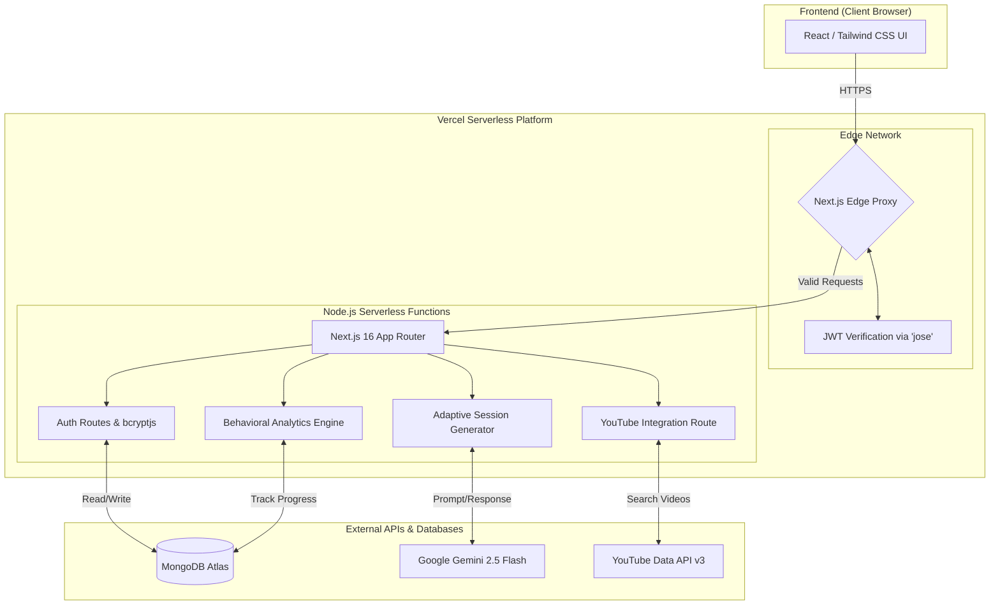

<div align="center">
  <h1>🚀 MotivateAI</h1>
  <p><strong>Your Autonomous Consistency Agent</strong></p>
  <p>An intelligent learning companion designed to combat the 95% dropout rate in self-directed learning by adapting to your behavioral patterns in real-time.</p>
</div>

---

## 📖 Overview

Self-directed learning is incredibly difficult. Most learners abandon their goals because they try to follow rigid schedules that don't match their actual working style. 

**MotivateAI** flips this model. Instead of forcing you to adapt to a schedule, it uses **Gemini 2.5 Flash** and **Behavioral Analytics** to adapt the schedule to *you*. It breaks monumental goals into 10-30 minute micro-tasks, monitors your completion rates and break patterns, and dynamically generates future sessions tailored to when and how you learn best.

## ✨ Core Features

- 🧠 **Adaptive AI Session Generation:** Uses Gemini 2.5 Flash to deconstruct massive learning goals into highly specific, actionable micro-tasks.
- 📊 **Behavioral Analytics Engine:** Tracks your focus duration, preferred break times, and drop-off signals to optimize your learning schedule automatically.
- 🎥 **Targeted YouTube Integration:** Automatically sources short, hyper-relevant YouTube tutorials for your current micro-task to prevent context switching.
- 🔒 **Secure Authentication & Identity:** Built with custom JWT-based authentication and Next.js Edge Proxy for strict access control and IDOR prevention.
- 🎨 **Modern, Responsive UI:** A sleek, glassmorphic dark-mode interface built with Tailwind CSS.

## 🏛️ System Architecture



## 🛠️ Technology Stack

- **Frontend & Backend Framework:** Next.js 16 (App Router)
- **Language:** TypeScript
- **Database:** MongoDB (Atlas)
- **AI Integration:** `@google/generative-ai` (Gemini 2.5 Flash)
- **Authentication:** `jose` (JWT Cryptography), `bcryptjs` (Password Hashing)
- **Styling:** Tailwind CSS

---

## 🚀 Getting Started (Local Development)

### 1. Prerequisites
- Node.js 18+ installed
- A MongoDB Atlas cluster (free tier works perfectly)
- A Google Gemini API Key

### 2. Installation
Clone the repository and install dependencies:
```bash
git clone https://github.com/aaminashihab/MotivateAI.git
cd MotivateAI
npm install
```

### 3. Environment Variables
Create a `.env.local` file in the root directory and add the following keys:
```env
# MongoDB Connection String (must allow 0.0.0.0/0 in Network Access)
MONGODB_URI=mongodb+srv://<username>:<password>@cluster0...

# Cryptographically secure random string for signing JWTs
# Run `node -e "console.log(require('crypto').randomBytes(32).toString('hex'))"` to generate one
JWT_SECRET=your_super_secret_jwt_key_here

# Your Google Gemini API Key
GEMINI_API_KEY=your_gemini_api_key_here

# YouTube Data API v3 Key (Optional: for fetching video tutorials)
YOUTUBE_API_KEY=your_youtube_api_key_here
```

### 4. Run the Development Server
```bash
npm run dev
```
Open [http://localhost:3000](http://localhost:3000) in your browser to see the application.

---

## 🔒 Security Architecture & Known Limitations

As a portfolio project designed to demonstrate core product velocity alongside engineering maturity, several explicit architectural tradeoffs were made:

- **Edge-Level Authorization:** The application utilizes a Next.js `proxy.ts` (Edge Middleware) to verify JWT signatures on all protected routes. The application is strictly configured to throw a fatal `500 Internal Server Error` if `JWT_SECRET` is missing in production, preventing dangerous unauthenticated fallbacks.
- **IDOR Mitigations:** Client-provided `userId` parameters in URLs (e.g., `/api/users/[userId]/preferences`) are explicitly ignored for authorization. Access control is verified strictly against the server-derived `x-user-id` header injected by the JWT middleware.
- **In-Memory Rate Limiting:** The AI and YouTube API routes currently utilize an in-memory `Map` for rate limiting. In a Vercel serverless environment, this state does not persist across cold starts. A production deployment would swap this for a centralized Redis store (e.g., Upstash).
- **Prompt Injection:** Agent endpoints employ regex-based filtering to strip basic prompt injection attacks (e.g., "ignore previous instructions"). Enterprise-grade deployment would require output-side validation and strictly scoped, read-only database roles.
- **Password Reset Flow:** For demonstration purposes, reset links are printed to the console rather than dispatched via an email provider (like Resend).

---

## 📜 License

This project is licensed under the [MIT License](LICENSE).

---

<div align="center">
  <p>Built with ❤️ for learners everywhere.</p>
</div>
