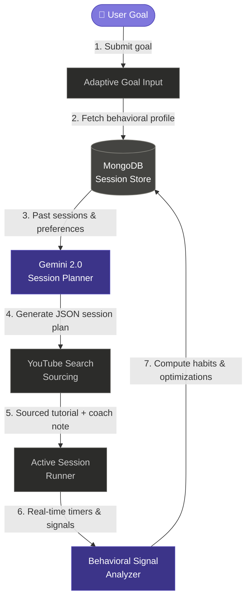

# MotivateAI 🔥
### Your Autonomous AI Agent for Building Learning Consistency

> Built for the **Google Cloud Rapid Agent Hackathon** — an AI-powered learning coach that actively builds sustainable study habits by dynamically scheduling tasks, sourcing real-world learning materials, and intelligently managing breaks.

[](https://motivateai-471444428139.europe-west1.run.app)
[](https://github.com/aaminashihab/MotivateAI)
[](https://nextjs.org)
[](https://ai.google.dev)
[](https://youtu.be/hqcipLO0GUY)

---

## 📺 Demo

> 📹 **[Watch the 4-minute demo on YouTube →](https://youtu.be/hqcipLO0GUY)**

---

## 💡 The Problem

Self-directed online learning is fundamentally broken. **Over 95% of self-learners drop out of online courses.**

| Existing Solution | What It Lacks |
|---|---|
| Content platforms (YouTube, Udemy) | Zero accountability — once momentum drops, users disappear |
| Habit trackers (Streaks, Habitica) | Gamify completion but don't adapt to how you actually learn |
| Human tutors | Expensive, unavailable 24/7, impossible to scale |
| Traditional courses | One-size-fits-all — doesn't adapt to your pace or struggle |

---

## 🧠 The Solution

MotivateAI acts as an **always-on cognitive learning companion**. Using Google Gemini 2.0, it analyzes your real-time learning signals — historical task completion rates, average focus durations, optimal break intervals, and focus drop-off thresholds — to dynamically schedule every micro-session specifically to your focus habits.

---

## 🏗️ System Architecture



---

## ✨ Core Features

### 1. Autonomous Session Generation
Submit any learning goal (e.g. "Learn Python encapsulation"). Gemini 2.0 reviews your profile history, calculates your momentum, and generates an optimized curriculum split into bite-sized tasks. It automatically fetches a relevant YouTube tutorial and places a personalized Coach Note guiding you to the most relevant timestamp.

### 2. Empathic AI Coach Check-in
Every dashboard load triggers a Gemini-generated personalized message referencing your actual history — streak status, last concept completed, or a non-guilt-tripping nudge if you've been away.

### 3. Active Session Runner & Break Manager
Each task has a circular SVG countdown timer. Between sessions, a break timer triggers with a motivational quote and customized activities (hydration, breathing, stretches) based on your fatigue patterns.

### 4. Interactive Behavioral Analytics
Full-scale visual reporting powered by **Recharts**:
- **Consistency Trend** — 7-day line chart of task completion rates vs. weighted engagement score
- **Peak Performance Times** — bar chart grouping performance scores by time of day
- **Task Difficulty Breakdown** — donut chart showing comfort across Easy / Medium / Hard tasks
- **Weekly Aggregations** — total study hours, active sessions, and streak count

### 5. Optimization Engine ⭐
The standout feature: click **Run Optimization Engine** to trigger a Gemini analysis over your last 30 sessions. The model reviews your break skip rates and performance drop-offs, generates before/after comparisons with clinical reasoning, and automatically applies new settings to your profile.

---

## 🛠️ Technology Stack

| Layer | Technology |
|---|---|
| Frontend | Next.js 15 (App Router), React 19, TypeScript |
| Styling | Tailwind CSS — Dark Glassmorphism UI |
| Database | MongoDB (session logs, preferences, optimization history) |
| AI Model | Google Gemini 2.0 Flash via `@google/generative-ai` SDK |
| Integrations | YouTube Data API v3 |
| Deployment | Google Cloud Run (europe-west1) + Cloud Build CI/CD |
| Containerization | Docker (multi-stage optimized build) |

---

## 🔒 Security Implementation

| Measure | Implementation |
|---|---|
| Prompt sanitization | User goals truncated to 100 chars, sanitized against injection patterns |
| System isolation | Instructions partitioned inside Gemini's `systemInstruction` parameter |
| Schema enforcement | Every API call enforces `responseSchema` for guaranteed Type Safety |

---

## 👤 My Contribution

This project was built using AI-assisted development for the Google Cloud Hackathon. My specific contributions:

- Designed the **Gemini prompt architecture** — schema structure, system instructions, and JSON response contracts
- Made the **product decisions** — feature prioritization, UX flow, and behavioral analytics design
- Configured **Google Cloud Run deployment** (europe-west1) with environment-based secrets management
- Implemented **security patterns** including prompt sanitization and schema enforcement
- Integrated **YouTube Data API** for automated tutorial sourcing

---

## 🚀 What I'd Build Next

- Google OAuth login for persistent cross-device profiles
- Mobile app (React Native) for on-the-go session tracking
- Offline mode with local session caching
- Peer accountability groups — study with friends, see each other's streaks

---

## ⚡ Quick Start

### 1. Clone the repository
```bash
git clone https://github.com/aaminashihab/MotivateAI.git
cd MotivateAI
```

### 2. Install dependencies
```bash
npm install
```

### 3. Configure environment variables
Create a `.env.local` file:
```env
# Google AI Studio — aistudio.google.com
GEMINI_API_KEY=your_gemini_api_key_here

# Google Cloud Console — console.cloud.google.com
YOUTUBE_API_KEY=your_youtube_api_key_here

# MongoDB Atlas — mongodb.com
MONGODB_URI=your_mongodb_connection_string_here
```

### 4. Run locally
```bash
npm run dev
# Open http://localhost:3000
```

---

## ☁️ Cloud Deployment (Google Cloud Run)

```bash
gcloud run services update motivateai \
  --set-env-vars GEMINI_API_KEY=xxx,YOUTUBE_API_KEY=xxx,MONGODB_URI=xxx \
  --region europe-west1
```

The app uses a multi-stage Dockerfile with Cloud Build configured to auto-deploy on every push to main.

---

## 📄 License

MIT — see [LICENSE](LICENSE)
